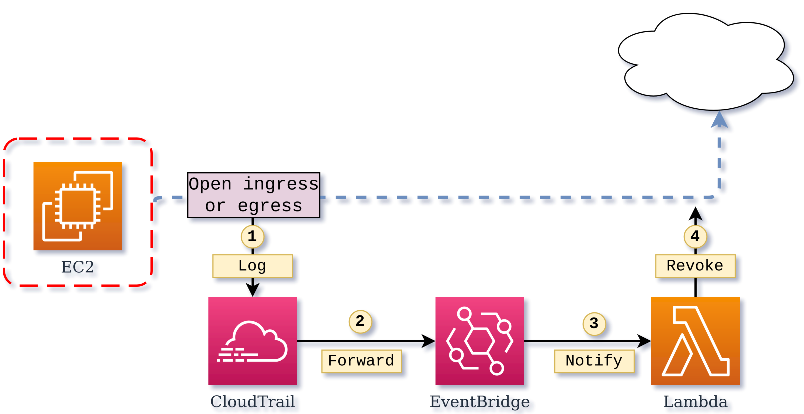

# Writing and testing AWS Lambdas in Python

Example code for 
* [10 Recommendations for writing pragmatic AWS Lambdas in Python](https://medium.com/@jan.groth.de/10-recommendations-for-writing-pragmatic-aws-lambdas-in-python-5f4b038caafe)



## How to deploy

Assumes:
* General understanding of how to build and run AWS SAM applications

Prerequisites:
* Python 3.7
* `pip3` (or `pip` aliased to `pip3`)
* `make`
* `aws-cli`

Tested on:
* Linux
* MacOS 

### Setup (via Python pipenv)

* Install dependencies:
```shell script
make install-dependencies
```
* Note:
    * Depending on your local setup you might want to change `pip3` to `pip`. This makefile assumes the Python3 version. 
    * Running `make install-dependencies` is a one-off task, feel free to install the required Python packages with your preferred tool)

* Change into `pipenv`-shell:
```shell script
pipenv shell
```

* Configure AWS profile:
```shell script
export AWS_PROFILE=[your profile name]
```
(or use the *default* profile if configured) 

* Create artifact bucket:
    * Edit `ARTIFACT_BUCKET` in `Makefile` to become globally unique 
    * E.g. `default-sg-remediation-artifacts-[your account id]`
```shell script
make create-artifact-bucket
```

### Deploy application

```shell script
make deploy
```

## How to test

* Change _egress_ or _ingress_ on the default security group
    * Lambda gets invoked
    * egress/ingress get revoked
    * security group gets tagged
